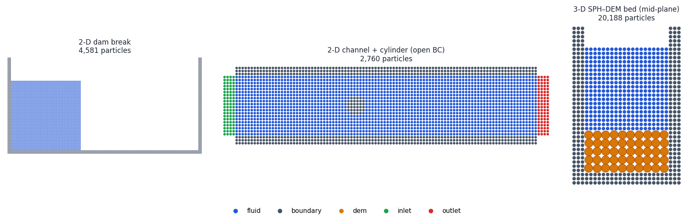
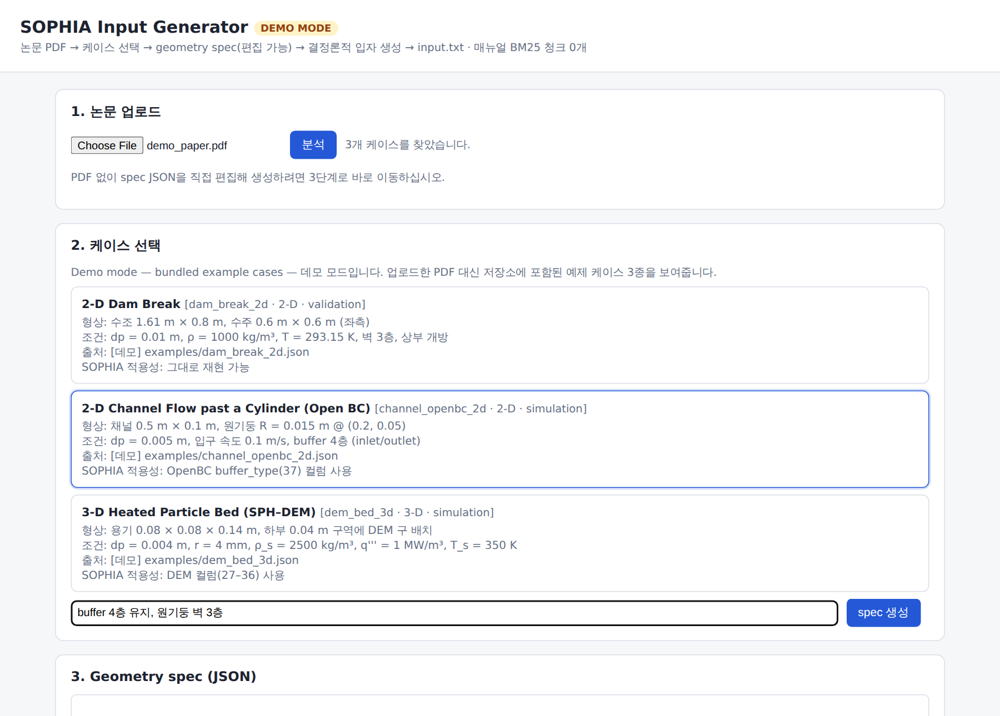
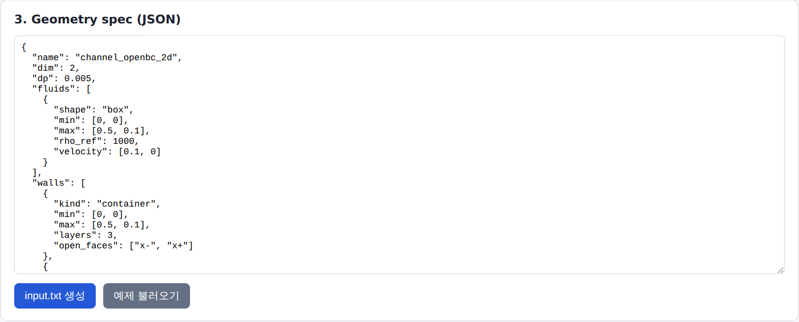
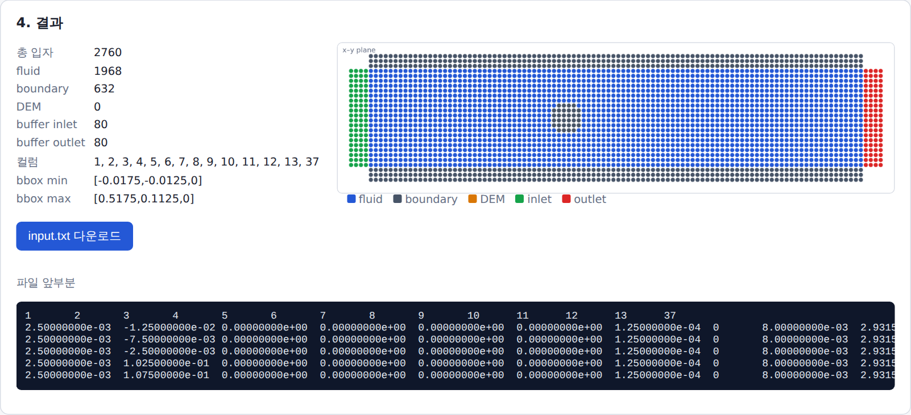
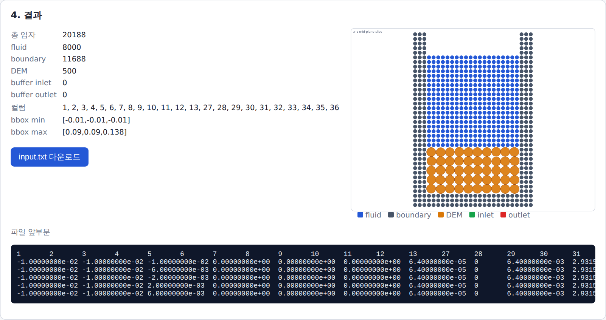
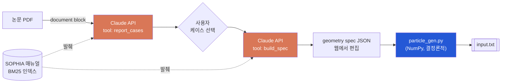

<div align="center">

# SOPHIA Input Generator

**논문 PDF 한 편 → SOPHIA `input.txt`**

SNU ESLAB의 GPU SPH/DEM 코드 **SOPHIA**에서 쓸 초기 입자 파일을, 논문에 나온 시뮬레이션 세팅으로부터 자동 생성하는 웹 앱입니다.




<sub>저장소에 포함된 예제 spec 3종으로 만든 초기 입자 배치 (파랑 fluid · 회색 boundary · 주황 DEM · 초록 inlet · 빨강 outlet)</sub>

</div>

---

## 목차

- [데모 바로 실행하기](#데모-바로-실행하기)
- [실행 화면](#실행-화면)
- [동작 원리](#동작-원리)
- [input.txt 형식](#inputtxt-형식)
- [설치 및 실행](#설치-및-실행)
- [geometry spec 레퍼런스](#geometry-spec-레퍼런스)
- [파일 구조](#파일-구조)

---

## 데모 바로 실행하기

API 키 없이 UI 전체 흐름을 확인할 수 있습니다. 데모 모드에서는 업로드한 PDF를 읽지 않고, 저장소의 예제 케이스 3종을 논문에서 추출한 것처럼 보여줍니다.

```bash
git clone https://github.com/hojin9908/sophia-input-generator.git
cd sophia-input-generator
pip install -r requirements.txt
SOPHIA_DEMO=1 python app.py            # Windows(cmd): set SOPHIA_DEMO=1 && py app.py
# → http://127.0.0.1:5000
```

## 실행 화면

### ① 논문 업로드 → 케이스 선택

Claude가 논문을 읽고 SOPHIA로 재현 가능한 케이스를 형상 · 조건 · 출처 · 적용성과 함께 정리합니다. 하나를 고르고, 필요하면 추가 요청(예: `dp=0.005로`)을 적습니다.



### ② Geometry spec 확인 · 수정

선택한 케이스의 형상이 JSON spec으로 추출됩니다. 논문에 없던 값은 `assumptions`에 표시되며, 생성 전에 직접 고칠 수 있습니다.



### ③ 입자 생성 결과

결정론적 엔진이 입자를 배치하고, 입자 종류별 개수 · 출력 컬럼 · bounding box · 파일 앞부분 · 배치 미리보기를 보여줍니다.

| 2-D 채널 + 원기둥 (open boundary) | 3-D SPH–DEM 베드 (x–z 중앙 단면) |
|:---:|:---:|
|  |  |
| inlet/outlet buffer 4층 → 37번 컬럼 추가 | DEM 입자 존재 → 27–36번 컬럼 추가 |

<sub>스크린샷은 데모 모드에서 `scripts/make_screenshots.py`로 캡처했습니다.</sub>

---

## 동작 원리



| 역할 | 담당 | 이유 |
|---|---|---|
| 논문 해석, 형상 · 물성 추출 | Claude API (`tool_choice` 강제) | 비정형 텍스트 이해. 응답이 이미 dict라 `json.loads` 불필요 |
| 입자 좌표 수천~수백만 개 | `particle_gen.py` | LLM은 정밀 좌표를 신뢰성 있게 만들지 못함. 같은 spec이면 항상 같은 결과 |
| 매뉴얼 참조 (RAG) | `rag.py` 순수 Python BM25 | 외부 임베딩 API 불필요 |

### 생성 규칙

| 항목 | 식 | 예시 |
|---|---|---|
| 격자 (셀 중심) | $x_i = x_{min} + (i + \tfrac12) d_p$ | $d_p=0.01$ → 첫 입자 $x=0.005$ m |
| 질량 | $m = \rho_{ref} d_p^3$ | $1000 \times 0.01^3 = 10^{-3}$ kg |
| 스무딩 길이 | $h = 1.6 d_p$ | $d_p=0.01$ → $h = 0.016$ m |
| 정수압 (옵션) | $p = \rho_{ref} \lvert g\rvert (y_s - y)$ | 수심 0.6 m, $y=0.005$ → $p \approx 5837$ Pa |
| DEM 질량 | $m = \rho_s \tfrac43 \pi r^3$ | $r=4$ mm, $\rho_s=2500$ → $6.70\times10^{-4}$ kg |
| Open boundary | $x = x_b + n(k+\tfrac12) d_p$, $k=0,\dots,3$ | buffer 4층 (ESLAB OpenBC, Tafuni et al. 2018) |

---

## input.txt 형식

탭 구분 텍스트입니다. 첫 줄은 **변수 인덱스 번호**, 둘째 줄부터 입자 1개당 1줄입니다.

```text
1	2	3	4	5	6	7	8	9	10	11	12	13	37
2.50000000e-03	-1.25000000e-02	0.00000000e+00	...	1.25000000e-04	0	8.00000000e-03	...	0
```

> [!IMPORTANT]
> 아래는 연구실에서 확인한 최신 매핑입니다. SOPHIA User Guide Table 5.1.1의 27–34번은 구버전이므로 따르지 않습니다.

| 인덱스 | 변수 | 인덱스 | 변수 |
|---|---|---|---|
| 1–3 | `x, y, z` | 27 | `rad` |
| 4–6 | `ux, uy, uz` | 28 | `ri` |
| 7 | `m` | 29 | `dem_idx` |
| 8 | `p_type` — 0 boundary · 1 fluid · 1001 DEM | 30–32 | `wx, wy, wz` |
| 9 | `h` | 33–35 | `temp1, temp2, temp3` |
| 10 | `temp` | 36 | `vol_power` |
| 11 | `pres` | 37 | `buffer_type` — 1 inlet · 2 outlet |
| 12, 13 | `rho, rho_ref` | 14–26 | `ftotal … concn_a` (`extra_columns`로 선택) |

**조건부 컬럼 출력**: 1–13은 항상, 27–36은 DEM 입자가 있을 때만, 37은 open boundary 입자가 있을 때만 씁니다. SPH/경계 입자의 DEM 컬럼 값은 0입니다.

---

## 설치 및 실행

<details open>
<summary><b>Windows (로컬)</b></summary>

```bat
git clone https://github.com/hojin9908/sophia-input-generator.git
cd sophia-input-generator
copy .env.example .env
rem .env 에 ANTHROPIC_API_KEY 입력
run.bat
```

`run.bat`은 `py` 런처를 먼저 찾습니다. MSYS2의 `python`이 PATH에서 python.org Python 3.12를 가리는 문제를 피하기 위해서입니다. 직접 실행한다면 `py -m pip install -r requirements.txt` → `py app.py` 순서로 하십시오.

</details>

<details>
<summary><b>Linux 서버 (sudo 불필요)</b></summary>

```bash
cp .env.example .env && vi .env     # ANTHROPIC_API_KEY
./start_server.sh                   # venv 생성 → gunicorn 데몬 실행 (logs/)
crontab -e                          # 재부팅 시 자동 시작
# @reboot /home/<user>/sophia-input-generator/start_server.sh
```

> [!WARNING]
> **worker는 반드시 1개**(`--workers 1 --threads 8`)여야 합니다. 세션 상태가 프로세스 메모리의 `SESSIONS` dict에 있으므로, worker가 여러 개면 요청이 다른 프로세스로 가서 `session not found`가 납니다. 동시 처리는 thread로 확보합니다.

</details>

<details>
<summary><b>CLI만 사용 (API 키 불필요)</b></summary>

```bash
python particle_gen.py examples/dam_break_2d.json input.txt
```

</details>

<details>
<summary><b>매뉴얼 RAG</b></summary>

`manuals/`에 SOPHIA User/Theory Guide(PDF · txt · md)를 넣으면 앱 시작 시 BM25 인덱스를 만들어 프롬프트에 관련 발췌를 붙입니다. 연구실 내부 문서이므로 저장소에는 포함하지 않습니다(`.gitignore`).

</details>

### 환경 변수

| 변수 | 기본값 | 설명 |
|---|---|---|
| `ANTHROPIC_API_KEY` | — | 필수 (데모 모드 제외) |
| `ANTHROPIC_MODEL` | `claude-sonnet-4-5` | 사용할 모델 |
| `SOPHIA_DEMO` | `0` | `1`이면 API 없이 예제 케이스로 동작 |
| `HOST` / `PORT` | `127.0.0.1` / `5000` | 개발 서버 주소 |

---

## geometry spec 레퍼런스

```json
{
  "name": "dam_break_2d", "dim": 2, "dp": 0.01, "h_factor": 1.6, "gravity": [0, -9.81, 0],
  "fluids": [{"shape": "box", "min": [0, 0], "max": [0.6, 0.6], "rho_ref": 1000, "hydrostatic": true}],
  "walls":  [{"kind": "container", "min": [0, 0], "max": [1.61, 0.8], "layers": 3, "open_faces": ["y+"]}],
  "dem": [], "open_boundaries": []
}
```

<details>
<summary><b>필드 전체 보기</b></summary>

| 블록 | 필드 |
|---|---|
| 공통 | `name`, `dim` (2\|3), `dp`, `h_factor` (1.6), `gravity`, `extra_columns`, `dem_idx_start` |
| shape | `box` (`min`, `max`) · `cylinder` (`axis`, `center`, `radius`, `length_min/max`; 2-D에서는 원) · `sphere` (`center`, `radius`) |
| `fluids[]` | shape + `rho_ref`, `temp`, `velocity`, `p_type`, `hydrostatic`, `free_surface`, `up_axis`, `exclude_dem` |
| `walls[]` | `kind: container` (`min`, `max`, `layers`, `open_faces`) · `kind: solid` (shape + `layers` 또는 `"full"`) |
| `dem[]` | `region` (shape), `radius`, `rho`, `arrangement` (`cubic`\|`hex`), `temp`, `vol_power`, `ri`, `jitter`, `seed` |
| `open_boundaries[]` | `type` (inlet\|outlet), `axis`, `position`, `outward` (±1), `span_min/max`, `layers` (4), `velocity`, `p_type` |

예시 전체는 [`examples/`](examples/)에 있습니다.

</details>

---

## 파일 구조

```text
sophia-input-generator/
├── app.py              Flask 라우트, SESSIONS
├── llm.py              Claude API: report_cases / build_spec 도구 정의
├── demo.py             데모 모드 (API 없이 예제 케이스 반환)
├── particle_gen.py     결정론적 입자 생성 엔진 (+CLI)
├── sophia_format.py    인덱스 매핑, input.txt writer
├── rag.py              BM25 매뉴얼 검색
├── templates/          웹 UI
├── examples/           dam break · open BC 채널 · DEM 베드 spec
├── tests/              pytest
├── scripts/            README 이미지 재생성 (스크린샷, 갤러리)
├── docs/               README 이미지
├── run.bat             Windows 실행
└── start_server.sh     Linux gunicorn 실행
```

## 테스트

```bash
python -m pytest -q
```

## 확인이 필요한 가정

- open boundary buffer 입자의 `p_type`은 기본 1(fluid)이며, spec의 `p_type`으로 바꿀 수 있습니다.
- DEM `ri`는 기본값이 반지름과 같고, `dem_idx`는 0부터 부여합니다(`dem_idx_start`로 변경 가능).
- 2-D에서도 연구실 규칙에 따라 $m=\rho_{ref} d_p^3$을 사용합니다.
- DEM 구역 안의 SPH 유체 입자는 기본적으로 제거합니다(`exclude_dem: false`로 유지 가능).
